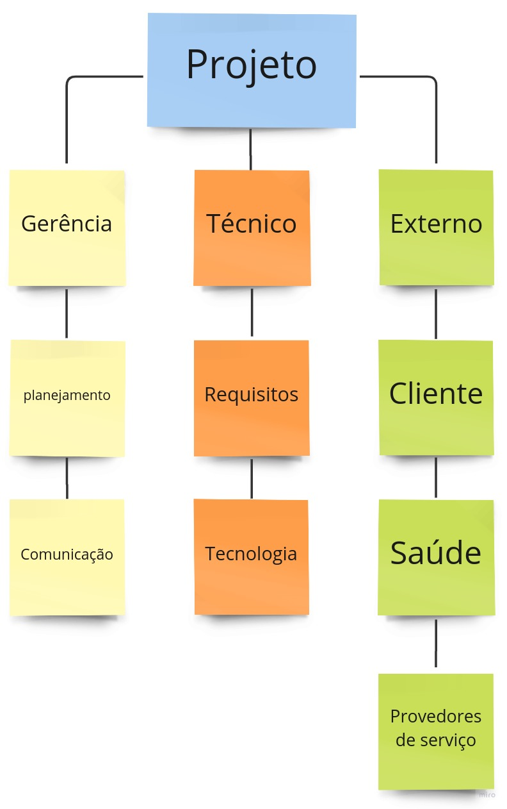

# Plano de gestão de riscos

## 1. Histórico de versão

| Versão |    Data    |      Comentário      |            Autor(es)            |
| :----: | :--------: | :------------------: | :-----------------------------: |
|  1.0   | 09/12/2022 | Criação do documento | Kleidson Alves, Lucas Rodrigues |
|  2.0   | 12/12/2022 | Classificação do EAR | Kleidson Alves, Lucas Rodrigues |

### 2. Resumo

Esse documento busca identificar possíveis riscos que possivelmente o projeto poderá enfrentar, além de analisar e planejar medidas possíveis para mitigar esses riscos uma vez que eles podem causar danos ao desenvolvimento do projeto

### 3. Estrutura Analítica de Riscos (EAR)

EAR é uma ferramenta por meio da qual os riscos apresentados ao projeto são organizados em categorias, sendo que cada categoria pode ser separada em outros níveis para detalhar a fonte do risco para o projeto. Abaixo estão apresentadas as categorias levantadas pela equipe.

    

### 4. Definições

#### Definição de probabilidade

| Nº  | Probabilidade | % de certeza |
| --- | ------------- | ------------ |
| 1   | Muito Baixa   | 0 a 20%      |
| 2   | Baixa         | 21 a 40%     |
| 3   | Média         | 41 a 60%     |
| 4   | Alta          | 61 a 80%     |
| 5   | Muito Alta    | > 80%        |

#### Definição de impacto

| Impacto     | Descrição                                      | Peso |
| ----------- | ---------------------------------------------- | ---- |
| Muito Baixo | Quase que imperceptível ao projeto             | 1    |
| Baixo       | Pouca influência no desenvolvimento do projeto | 2    |
| Médio       | Notável ao projeto                             | 3    |
| Alto        | Dificulta o desenvolvimento do projeto         | 4    |
| Muito Alto  | Impossibilita o prosseguimento do projeto      | 5    |

### 5. Riscos levantados

| ID  |              Descrição              |          Categoria EAR           |  Impacto   | Probabilidade |                                  Consequência                                   |
| :-: | :---------------------------------: | :------------------------------: | :--------: | :-----------: | :-----------------------------------------------------------------------------: |
| R01 | Desistência de um membro da equipe  |         Externo - saúde          |   baixo    |     baixa     |                Aumento da carga de trabalho para outros membros                 |
| R02 |   Dificuldade com as tecnologias    |       Técnico - tecnologia       | muito alto |     média     | Atraso nas entregas, baixa qualidade do produto ou até a não entrega do produto |
| R03 |        Falta de comunicação         |      Gerência - comunicação      | muito alto |     média     |   dificulta a organização da equipe e compromete o desenvolvimento do projeto   |
| R04 |       Divergência de horários       |     Gerência - planejamento      |   médio    |     alta      |            dificulta a aplicação da técnica de programação em pares             |
| R05 |      Instabilidade da internet      | Externo - provedores de serviços |    alto    |  muito baixa  |                Compromete a participação nas reuniões da sprint                 |
| R06 |          Mudança de escopo          |     Gerência - planejamento      |    alto    |     média     |        pode resultar em sobrecarga nas sprints realizadas após a mudança        |
| R07 |      Baixa motivação da equipe      |         Externo - saúde          | muito alto |     baixa     |              Atraso na conclusão das tarefas e baixa produtividade              |
| R08 | Falta de participação nas reuniões  |     Gerência - planejamento      |   médio    |     baixa     |                        Problemas de integração da equipe                        |
| R09 |       Insatisfação do cliente       |        Externo - cliente         | muito alto |  muito baixa  |                     Pode resultar na desmotivação da equipe                     |
| R10 | Não conclusão das tarefas da sprint |     Gerência - planejamento      |    alta    |     média     |        pode resultar em sobrecarga nas sprints realizadas após a mudança        |

## 6. Gerenciamento de Riscos

| ID  | Ação                                                                                                                   |
| :-: | ---------------------------------------------------------------------------------------------------------------------- |
| R01 | Redistribuição de atividades dentro do escopo do projeto                                                               |
| R02 | Estudo e pesquisa sobre as tecnologias a serem utilizadas. Realização de dojos para o compartilhamento de conhecimento |
| R03 | Reavaliar o processo de comunicação em equipe                                                                          |
| R04 | Realização das tarefas em pareamento                                                                                   |
| R05 | Alterar horário de realização da tarefa                                                                                |
| R06 | Adaptação do planejamento                                                                                              |
| R07 | Ajudar membros que estiverem com dificuldade na realização das tarefas                                                 |
| R08 | Constante comunicação por meios assíncronos                                                                            |
| R09 | Boa comunicação com o cliente e alinhamento de expectativas                                                            |
| R10 | Adaptar o planejamento para encaixar a realização das tarefas pendentes                                                |
