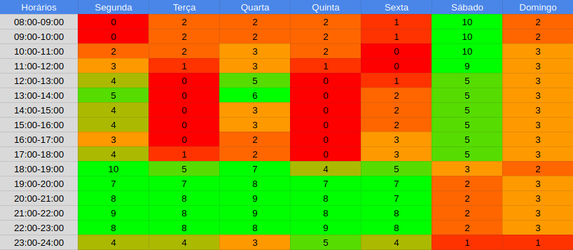

# Planejamento de Comunicação
Esse documento tem o propósito de mostrar o planejamento de comunicação do time, tanto em encontros síncronos 
como em encontros assíncronos, e as ferramentas utilizadas para esses propósitos.

## 1. Histórico de versão
| Versão | Data       | Descrição                                                                   | Autor           |
| ------ | ---------- | --------------------------------------------------------------------------- | --------------- |
| 0.1    | 10/12/2022 | Criação do documento e adição do artefato                                   | Thiago Mesquita |

## 2. Quadro de disponibilidade

## 2. Horários de reunião do time

| Dias | Horário | Reunião |
| :--------: | :--------: | :--------: |
| Segunda    | 18:30 | Reunião com o PO |
| Sábado     | 09:00 | Planning/Review |
| Segunda à Sexta    | 20:00 | Daily |

## 3. Ferramentas de comunicação

| | Ferramenta | Propósito |
| :--------: | :--------: | :--------: |
|    | Discord | Comunicação assíncrona com o PO/ Reuniões síncronas do Time/ Pareamento |
|    | Telegram | Comunicação assíncrona entre o time |
|    | Teams | Comunicação síncrona com o PO|
|    | Google Drive | Criação colaborativa de artefatos |
|    | Github | Repositórios de Documentação e Código do projeto |
|    | Zenhub | Kanban para acompanhamento das issues do projeto |