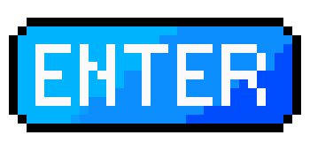

# Lean Inception
Lean inception é a combinação eficaz do Design Thinking e do Lean StartUp para decidir o Produto Mínimo Viável (MVP). É um workshop colaborativo dividido em várias etapas e atividades que irão direcionar a esquipe na construção do produto.

## 1. Histórico de versão
| Versão | Data       | Descrição                                                                   | Autor           |
| ------ | ---------- | --------------------------------------------------------------------------- | --------------- |
| 0.1    | 10/11/2022 | Criação do Documento                                   | Thiago Mesquita |

## 2. Planejamento

| Data | Etapa |
| :--------: | :--------: |
| 15/11/2022 | Visão do Produto |
| 15/11/2022 | O produto É - NÃO É - FAZ - NÃO FAZ |
| 15/11/2022 | Objetivos de Negócio |
| 16/11/2022 | Personas |
| 16/11/2022 | Jornada do Usuário |
| 16/11/2022 | Brainstorming de Funcionalidades |
| 18/11/2022 | Revisão Técnica, de Negócio e UX |
| 18/11/2022 | Sequenciador |
| 19/11/2022 | MVP Canvas |

## 3. Resultado

 
  <h1 style="position: relative;vertical-align: middle;display: inline-block; font-size: 24px; line-height:22px; color: #393939;margin-bottom: 10px; font-weight: 300;font-family: Proxima Nova, sans-serif;">  
  
 
    Lean Inception 
     
  
 </h1> 
  
 
 
  

   
  
 
  
 
 Lean Inception by Schedula 

